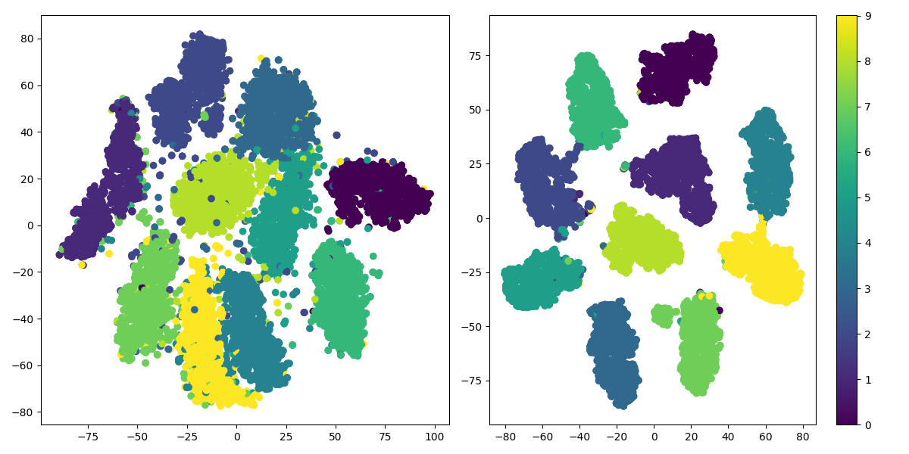
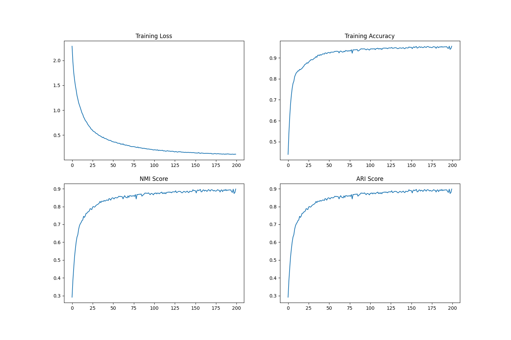

# deep-cluster-benchmark
eazy deep cluster algorithm (DEKM/IDEC/DCN)
## Requirements 
+ pytorch
+ torchversion
+ sklearn
+ numpy
+ argparse
## Usage
open your cmd and input:  
git clone https://github.com/Le0nidas-wow/deep-cluster-benchmark.git  
cd ./deep-cluster-benchmark  
python dcb.py  
if you want to change the parameter  
you can   
  
python dcb.py --model DEKM --dataset MNIST --lr 0.01 --momentum 0.9 --weight_decay 5e-4 --epoch 20  
  
you can choose MNIST/USPS/SVHN/CIFAR10/FashionMNIST as your dataset  
you can choose DEKM/IDEC/DCN as your model  
  
after you press your ENTER  
you can see the loss and acc of each epoch and the acc,ari and nmi of the test dataset.  
  
if your model is DCN recommend lr=0.001
if your dataset is CIFAR10 recommend epoch=50
if your GPU is good enough recommend lr=0.001 epoch=100
if you use CPU to run this code recommend lr=0.01 epoch=20 
  

the benchmark function has  implemented now.  

here is the result:  

## Thanks
*Chatgpt*  
*nvidia cuda*  
*pytorch*  
*python*  
and other developers  

